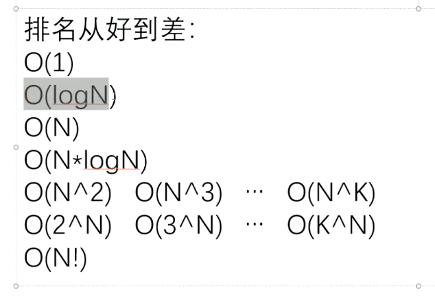

# 算法

## 评估算法

如果时间复杂度一样的算法对比，则直接通过测试比较就可以

## 对数器

### 位运算的使用

1. /2的操作可以>>1，/2+1可以>>1 | 1
2. x2的操作可以<<1，x2+1可以<<1 | 1

### 异或运算

进位为0的相加

- 对比同或运算：相同为1，不同为0

## 算法题解法

1. 找到一组数中只有一种数出现奇数次，找出这个数字

通过0^所有的数，剩下的数就是需要找的数字

> 因为0^N=N，N^N=0

2. 两个变量交换值，不申请额外的变量

a=a^b    b=a^b   a=a^b 可自行推断

3. 保留一个数二进制最右边的1

> ~取反   &与运算

(~N+1)&N

4. 找到一组数中的2种出现奇数次的数字

eor=0^arr[]=a^b不为0，说明某一位^结果为1

eor(某一位为`1`)^(arr[]&eor不为0的数) 得出其中一个数

另外一个数则把这个数^eor即可

## 数组

> 时间复杂读o(1)

买6g内存+128g存储就可以，买前记得问下是否支持5g

1. 华为：荣耀Play4T Pro（1499）、华为畅享20（1899）
2. vivo：iQOO Z1x（1699）
3. oppo：Realme Q2 Pro（1499）
4. 小米：Redmi 10X（1399）。Redmi K30（1599）、Redmi Note9 Pro（1599）

