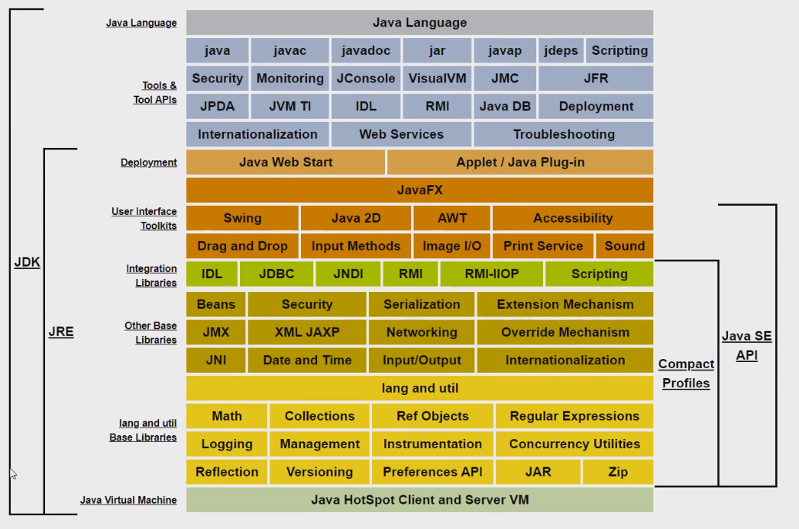
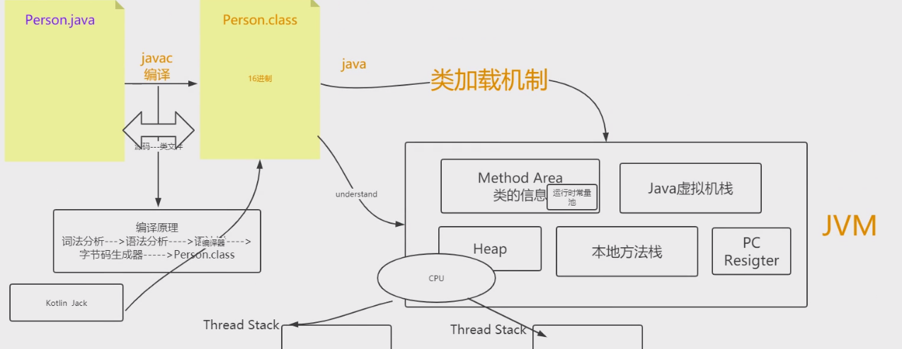
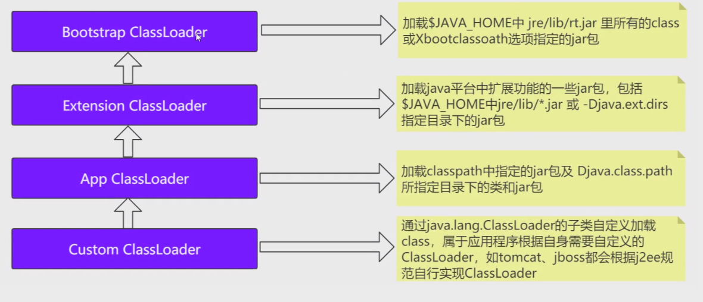
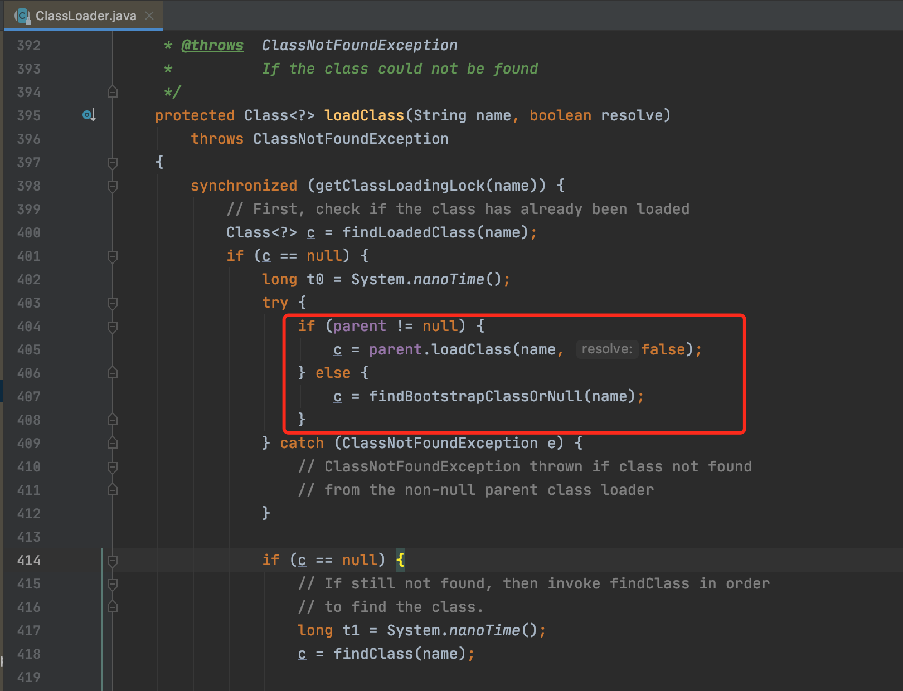
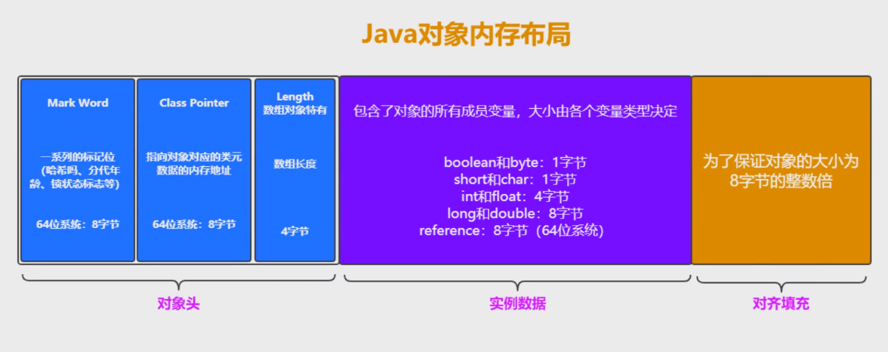
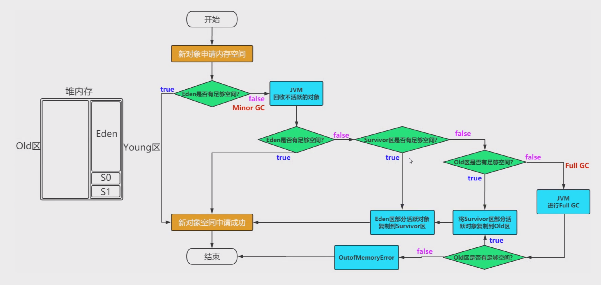

# JVM

> 文档地址：https://docs.oracle.com/javase/8/

## 基本原理

### 编译过程

#### 类加载过程

> 类装载模式：双亲委派模式
>
> 若自定义类加载自己写的java.lang的类，会抛出异常
>
> java.lang.securityException

**双亲委派如何破坏**：

### 运行时数据区

#### 方法区（Method Area）

**对象头信息**

#### 