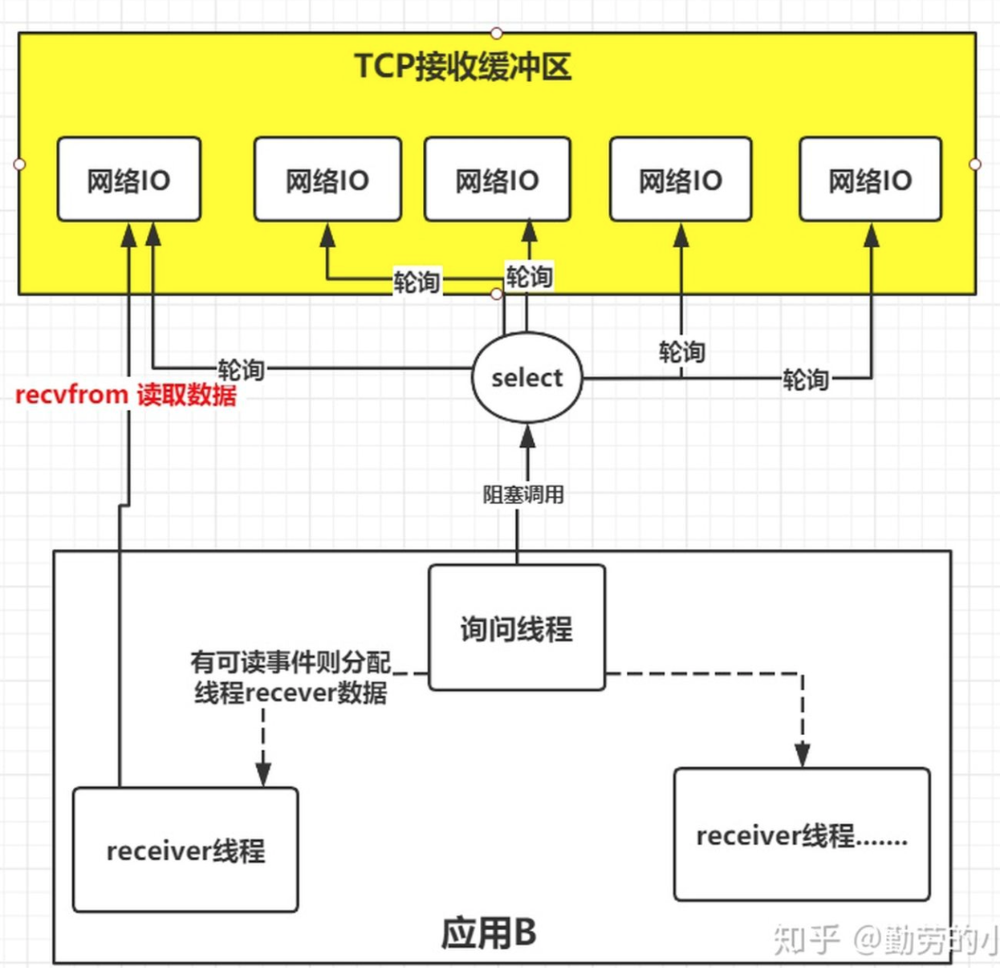

## 简述https原理

> 服务器持有密钥(s.pri)，客户端持有CA机构公钥(c.pub)
>
> CA机构通过自己的密钥(c.pri)加密服务器生成的公钥(s.pub)
>
> 客户端可以申请到CA机构的公钥(c.pub)

1. 服务器生成CSR文件（包括服务端公钥s.pub），在CA机构生成证书部署在nginx上
2. 浏览器基于https发送请求，服务器返回CA证书
3. 客户端内置的CA机构的公钥(c.pub)解密，并检验证书有效性。获取服务器公钥(s.pub)
4. 客户端生成随机`对称`密钥，通过服务器公钥(s.pub)加密
5. 服务器用私钥(s.pri)解密获取对称密钥
6. 双方通过对称密钥通信

## java序列化

> 序列化就是把对象状态转换为可`存储`或者可`传输`的对象，把对象转化为字节序列

jdk提供的序列化方式，传输主要通过`对象流`：java.io.ObjectOutputStream

序列化对象需要实现java.io.Serializable接口

- dubbo默认使用`hessian协议`序列化，也需要实现该接口
- springcloud-feign默认使用`json协议`序列化，不需要实现该接口

**serialVersionUID的作用：**通过判断serialVersionUID来校验版本一致性，若指定了该值，序列化后被修改了，仍然可以反序列化。若不指定，则对class进行摘要算法生成，若改动了class，就会抛出异常拒绝载入（InvalidCastException）。

- Transient 关键字可以阻止变量序列化

绕开Transient的方式：`writeObject和readObject`实现自定义序列化，若没该方法，在走jdk的序列化方式

**序列化方式选型**：

1. 性能要求不高：XML的SOAP协议
2. 性能要求高：Hessian、Protobuf、Thrift、Avro、
3. 对外api服务：Json

## 5种IO模型（linux）

tcp传输数据的时候，首先是通过网络传输到服务器的tcp接收缓冲区（处于内核），等待进程调用`recfrom`后将数据从`内核`拷贝到`用户空间`

1. 阻塞io

2. 非阻塞io：发起`recvfrom`读取数据，数据为准备好马上返回`EWOULDBLOCK`错误

3. io复用模型：通过slect或poll、epoll 来监控多fd ，来达到不必为每个fd创建一个对应的监控线程，从而减少线程资源创建的目的。

> linux把所有`网络请求`以fb来标识

4. 信号驱动IO模型

> 开启套接口信号驱动IO功能，并通过系统调用sigaction执行一个信号处理函数，此时请求即刻返回，当数据准备就绪时，就生成对应进程的SIGIO信号，通过信号回调通知应用线程调用recvfrom来读取数据。

5. 异步IO

> 内核收到请求后会建立一个信号联系，当数据准备就绪，内核会主动把数据从内核复制到用户空间，等所有操作都完成之后，内核会发起一个通知告诉应用

## io多路复用模型

### select

**调用过程**：

1. 调用select前告知需要监控的fd（可读、写、异常），并存在3个`fd_set`数组当中
2. 调用select把fd_set拷贝到`内核`去遍历扫描满足可读写的fd
3. 去除没有时间状态的fd句柄，返回给用户进程（fb数组从内核到用户空间拷贝）
4. 用户进程对符合条件fd进行读写

**性能瓶颈**：

1. fd_set数组**内核及用户空间之间**拷贝过程
2. select**遍历**fd_set过程
3. fd_set数组**长度**限制：32位1024，64位系统2048

### poll

> 类似select，区别在于通过链表替换了fd_set，链表的结构采用pollfd的文件格式。重新发请求不需要重置fd集合

### epoll

1. 创建内核事件表（epoll_create）。

这里主要是向内核申请创建一个fd的文件描述符作为内核事件表（B+树结构的文件，没有数量限制），这个描述符用来保存应用进程需要监控哪些fd和对应类型的事件。

2. 添加或移出监控的fd和事件类型（epoll_ctl）。

调用此方法可以是向内核的内核事件表 动态的添加和移出fd 和对应事件类型。

3. epoll_wait 绑定回调事件

内核向事件表的fd绑定一个回调函数。

4. 当监控的fd活跃时，会调用callback函数把事件加到一个活跃事件队列里，最后在epoll_wait 返回的时候内核会把活跃事件队列里的fd和事件类型返回给应用进程。

> epoll不需要像poll和select去遍历事件，而是创建fd对应的回调函数，事件激活后主动调用回调callback函数。事件表存在内核当中，避免`跨空间`拷贝

## BIO、NIO、AIO的区别

**同步和异步的区分**在于通知的方式：同步需要`自己去请求询`问是否完成，异步则通过`回调机制`通知调用者

**阻塞和非阻塞的区别**在于是否需要等结果返回：阻塞需要一直等到结果返回，非阻塞可以先处理其他任务

BIO（同步阻塞通信模型）：数据的读取和写入必须阻塞等待完成

> 通过线程池可以做到伪异步i/o

NIO（同步非阻塞通信模型）：核心组件（Buffer缓冲区、Channel通道、Selectors选择器）

> 底层是基于epoll实现

AIO（异步非阻塞）：内核数据处理好直接拷贝到用户进程，通知完成

> 对比NIO：NIO收到通知后，自己主动调用从内核到用户进程拷贝的过程

# redis

## 8大数据结构底层

1. string

2. Hash：zipList（key<64byte或者数量<512），大于用hashtable
3. List：quickList（双向链表+ziplist）

4. set：整数intset，其他hashtable

5. zset：数量<128，大小<64用ziplist，skiplist跳表

## 项目中的应用

1. 漂流瓶等从集合随机抽取的活动 spop
2. 点赞、签到、喜欢的用户等：key-like+uid   value-对象id
3. 商品标签：通过交集并集

#### 在线用户数量：

1. setbit onlineUsers （userId）1 设置在线状态
2. 计算数量bitcount onlineUsers
3. bitop and：查询交集（还有or、xor异或、not非）：可以查询最近7天在线的用户`BITOP "AND" "day1" "day2" "day3"...`

####  活动匹配：

1. set集合：spop弹出

# jvm

## 什么是双亲委派模型

> Bootstrap：<JAVA_HOME>\lib
>
> Extension：<JAVA_HOM E>\lib\ext
>
> Application：ClassPath路径下的类

HotSpot虚拟机下，当某个类加载器需要加载.class文件时，先把任务交给上级类加载器，如果没有加载则自己加载

## 如何破坏双亲委派模型

1. 自定义类加载器：重写loadClass方法
2. 通过`Thread.currentThread().getContextClassLoader()`得到线程上下文加载器来加载Driver实现类

# threalocal介绍

threadlocal的设值和取值操作的是Thread类里面的`threadlocalmap`，这是一个Entry数组，key是可以识别是哪个threadlocal的值。

**hash冲突**：才有线性探测的方式，寻找下一个没被占用的位置。查询的时候会验证当前key是否是该threadlocal的。不是的话查询效率很低，建议减少threadlocal的数量。

