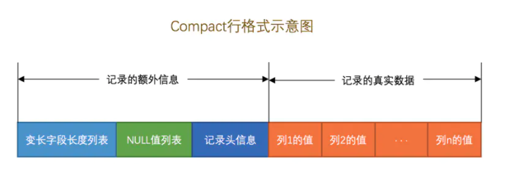
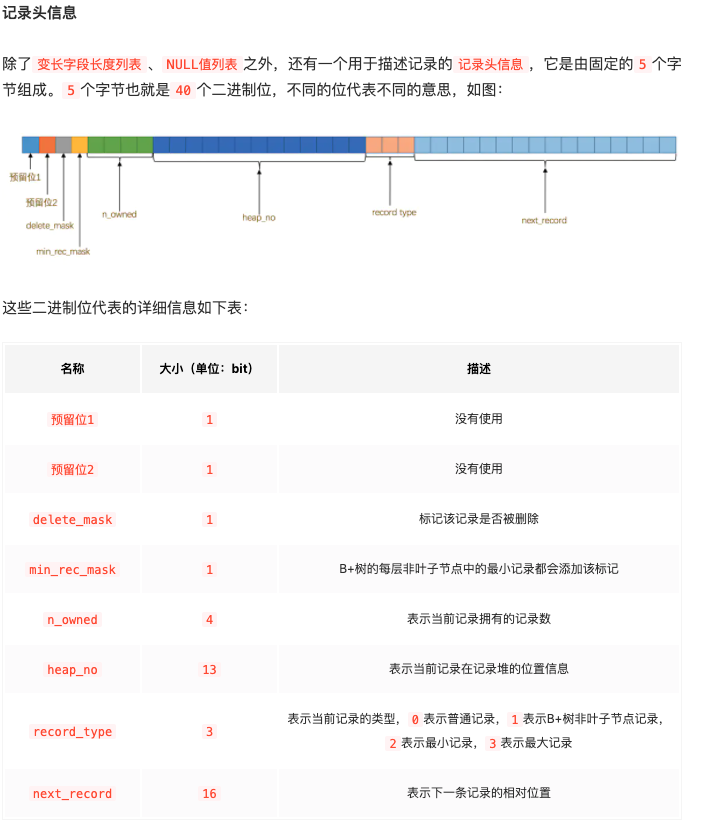
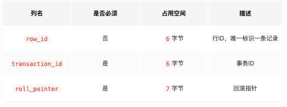
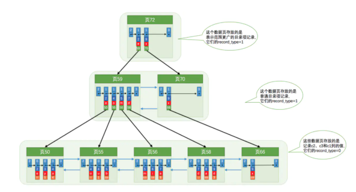

MySQL 是怎样运行的：从根儿上理解 MySQL

# InnoDB

## 页

数据划分为若干个`页`，是磁盘和内存交互的基本单位，页大小为16KB

### InnoDB行格式

其实就是磁盘存储的格式，分别是`Compact`、`Redundant`、`Dynamic`和`Compressed`行格式

> 变长字段列表存储：如果该可变字段允许存储的最大字节数超过255字节并且真实存储的字节数超过127字节，则使用2个字节，否则使用1个字节。为`null`的值不存储

变长字段以及NULL值列表和列的关系都是`逆序`排列

#### 记录头信息

**真实数据**：真实数据中除了存储的列数据外，加包含3个隐藏列

### 页结构

#### File Traller

mysql断电如何判断是否同步成功：通过`检验和`：同步前计算写入File Header，同步成功写入File Trailer，若成功则一致，失败则不同

#### 索引页

索引页中的数据是如何进行查询的：通过二分法

索引

### 关联查询

> 为什么要选择代价最低的表作为驱动表：

访问表被驱动表的次数取决于驱动表中符合条件的数据